# LitmusChaos-on-Amazon-EKS

Hello and Welcome to the _LitmusChaos-on-Amazon-EKS_ project!

# Overview:

Greetings! My name is Cecilia, and in this amazing project, I will show you how to utilize the principles of Chaos Engineering with LitmusChaos on Amazon EKS. Let's begin by understanding the concept of Chaos Engineering:

In a nutshell, Chaos Engineering is all about preparing for the worst. It is a methodology of experimenting on a system to determine how well it can withstand disruptive conditions in production. These disruptions often resemble a real-life incident. In other words, Chaos Engineering creates _chaos_ in an automated and controlled environment, to help engineers discover and understand weaknesses in systems.

LitmusChaos will be used to create the testing environment. [LitmusChaos](https://litmuschaos.io/) is a cloud-native Chaos Engineering framework, which is designed to work with Kubernetes. [Kubernetes](https://kubernetes.io/) is a portable, extensible, open-source platform which is used for managing containerized workloads and services. 

We will be using AWS EKS, which stands for Amazon Elastic Kubernetes Service. This managed service that will allow us run Kubernetes on AWS without needing to install, operate, and/or maintain our own Kubernetes control plane or nodes!

Litmus takes a cloud-native approach to create, manage, and monitor chaos. 

The Chaos is orchestrated using the following Kubernetes custom resource definitions (CRDs):

- **ChaosEngine**: A resource that links Kubernetes application or Kubernetes node to a ChaosExperiment.
- **ChaosExperiment**: A resource that groups the configuration parameters of a chaos experiment.
- **ChaosResult**: A resource that records the results of a ChaosExperiment.

Now that we've covered the tools we're working with, let's get started!

-----------------------------------------------------------------------------------------
## PART 1: Getting Started

We will begin by creating an Amazon EKS cluster with managed nodes. In order to achieve this, we will install LitmusChaos and a demo application. Next, we will install chaos experiments which will run on the demo application. Lastly, we will observe the behavior.

### PRE-REQUISITES

Prior to beginning the project, we must ensure that we have the following software installed on our local PC:

- [AWS CLI version 2](https://docs.aws.amazon.com/cli/latest/userguide/install-cliv2.html)
- [eksctl](https://docs.aws.amazon.com/eks/latest/userguide/eksctl.html)
- [kubectl](https://docs.aws.amazon.com/eks/latest/userguide/install-kubectl.html)
- [Helm](https://www.eksworkshop.com/beginner/060_helm/helm_intro/install/index.html)

Once you have installed the `AWS CLI version 2`, check the version on Terminal using the following command:

```
$ aws --version
```
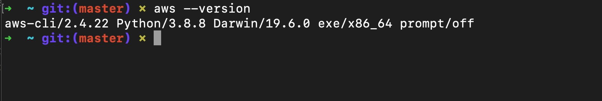

To configure your AWS account from your Terminal, use the following command:

```
$ aws configure
```


Also, sign in as the IAM user to the AWS management console. If you do not have an AWS account, please create one for free at [aws.amazon.com](https://aws.amazon.com).

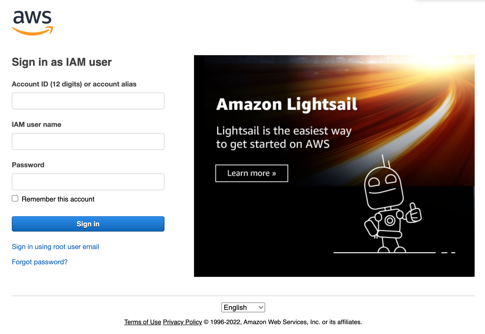

After you have installed `eksctl`, check the version on Terminal using the following command:

```
$ eksctl version
```

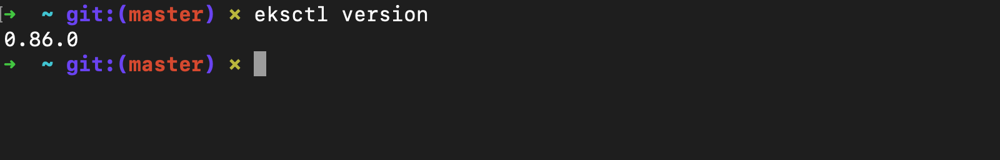

After you have installed `kubectl`, check the version on Terminal using the following command:

```
$ kubectl version --short --client
```

Lastly, install `Helm` using the following command:

```bash
curl -sSL https://raw.githubusercontent.com/helm/helm/master/scripts/get-helm-3 | bash
```

After you have installed `Helm`, check the version on Terminal using the following command:

```bash
$ helm version --short
```

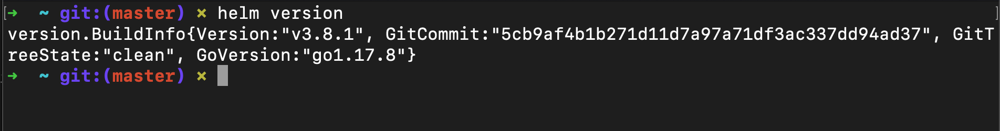


### STEP 1: Create EKS Cluster

Create a new EKS cluster using eksctl using the following commands:

- Open Terminal and run the following command:
    
    ```bash
    export ACCOUNT_ID=$(aws sts get-caller-identity --output text --query Account)
    export AWS_REGION=us-east-1 #change as per your region of choice
    ```
    
- Create a .yaml file using the following command:

```bash
$ touch cluster.yaml
```

- Next, using your editor of choice, edit the `cluster.yaml` file and place the following code within the file:

```bash
---
apiVersion: eksctl.io/v1alpha5
kind: ClusterConfig
metadata:
  name: eks-litmus-demo
  region: ${AWS_REGION}
  version: "1.21"
managedNodeGroups:
  - instanceType: m5.large
    amiFamily: AmazonLinux2
    name: eks-litmus-demo-ng
    desiredCapacity: 2
    minSize: 2
    maxSize: 4
```

_Be sure to replace ${AWS_REGION} with your preferred region._

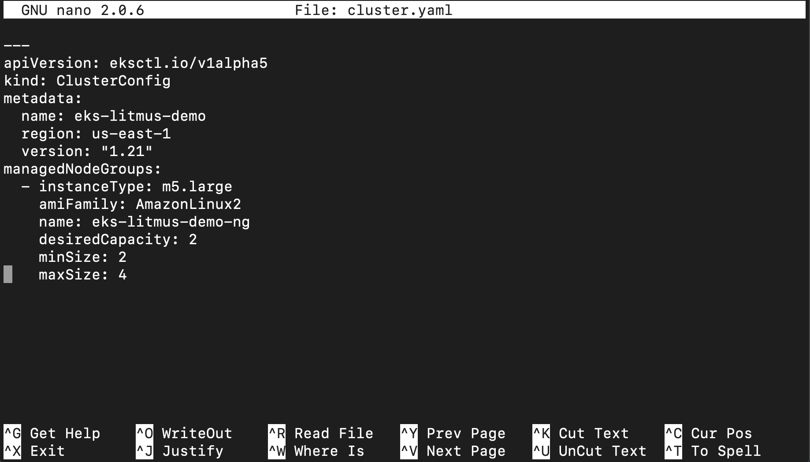

- Next, run the following command to create the cluster:

```
$ eksctl create cluster -f cluster.yaml
```

Be sure to replace the **${ }** with the corresponding information.

Now take a moment and relax. Your brand new cluster awaits! Please be patient, this may take several minutes.

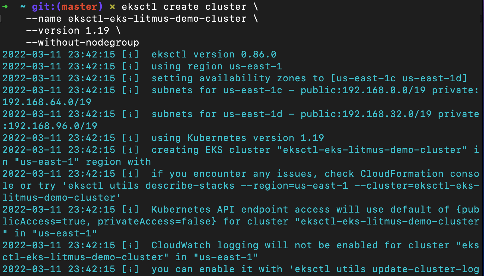

You can also check the status of your cluster on the [AWS Console](https://console.aws.amazon.com/). Sign in to your account and then navigate to `CloudFormation` service. Click `stacks` to view your cluster in progress.

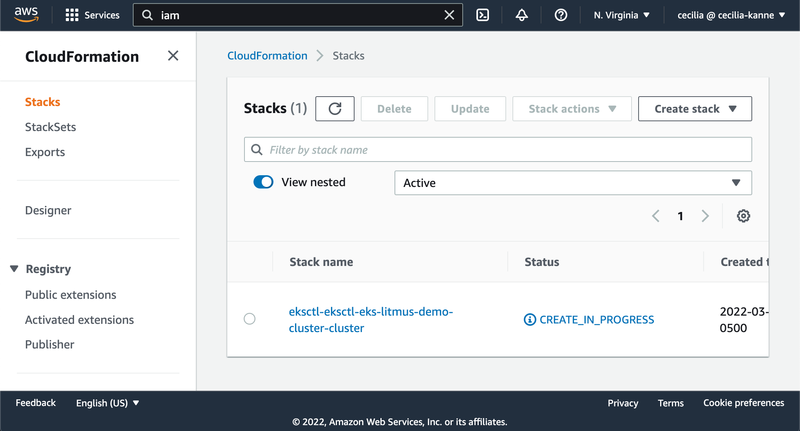

Once it has been completed, the status will change to `CREATE_COMPLETE`.

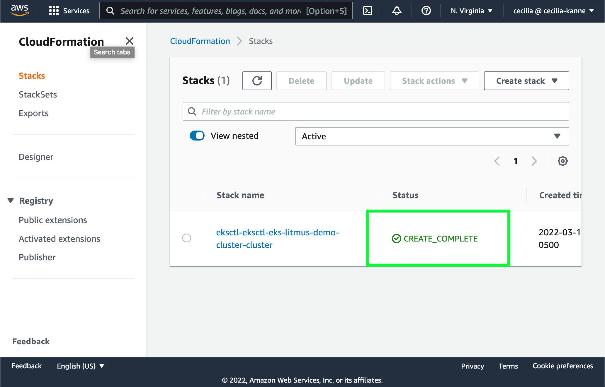

Once it has been created, we must add permissions by creating a nodegroup for your cluster.

To do this, navigate to the IAM service on the AWS Management Console. 

ABC........


After you have completed the steps, you should see the node group in your cluster:

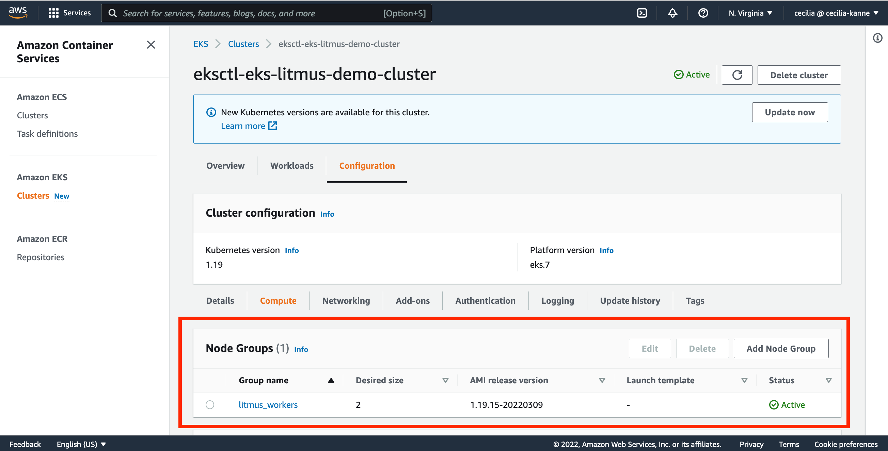

### STEP 3: Install LitmusChaos

Let’s install LitmusChaos on an Amazon EKS cluster using a Helm chart. The Helm chart will install the needed CRDs, service account configuration, and ChaosCenter.

Add the Litmus Helm repository using the command below:

```bash
helm repo add litmuschaos https://litmuschaos.github.io/litmus-helm/
```

Confirm that you have the Litmus-related Helm charts:

```bash
helm search repo litmuschaos
```

The output should look like below:

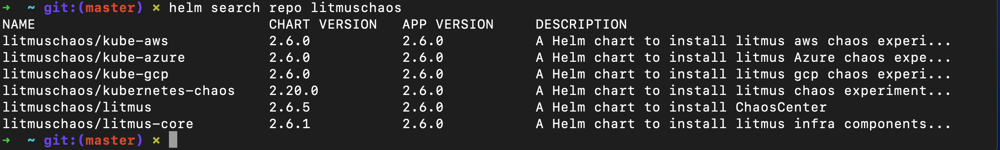


Create a namespace to install LitmusChaos.

```bash
kubectl create ns litmus
```

By default, Litmus Helm chart creates NodePort services. Let’s change the backend service type to ClusterIP and front-end service type to LoadBalancer, so we can access the Litmus ChaosCenter using a load balancer.

```bash
cat <<EOF > override-litmus.yaml
portal:
  server:
    service:
      type: ClusterIP
  frontend:
    service:
      type: LoadBalancer
EOF

helm install chaos litmuschaos/litmus --namespace=litmus -f override-litmus.yaml
```

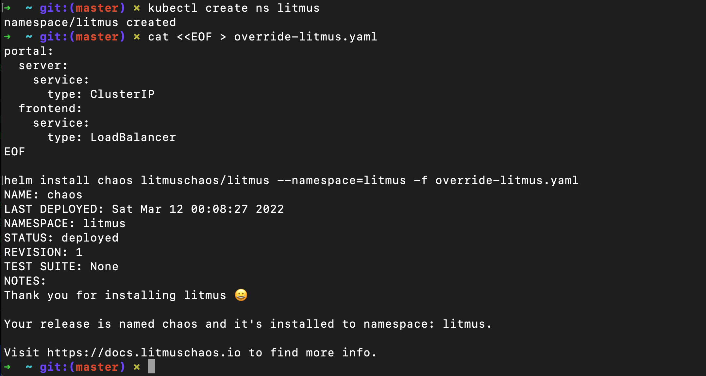

Verify that LitmusChaos is running:

```bash
kubectl get pods -n litmus
```

After a moment, uou should see a response similar to the one below:

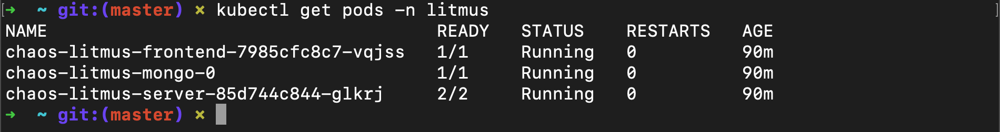


```bash
kubectl get svc -n litmus
```

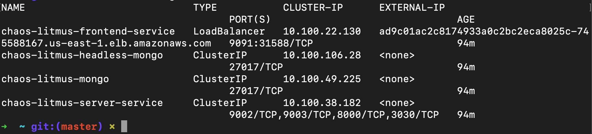


Now let's navigate to the LitmusChaos website:

```bash
$ export LITMUS_FRONTEND_SERVICE=`kubectl get svc chaos-litmus-frontend-service -n litmus --output jsonpath='{.status.loadBalancer.ingress[0].hostname}:{.spec.ports[0].port}'`

$ echo "Litmus ChaosCenter is available at http://$LITMUS_FRONTEND_SERVICE"
```

The output should look something like this:


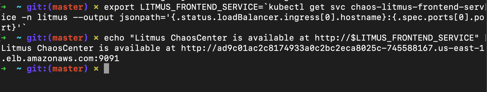

copy the http:// URL link provided, and enter it into your browser.

Next, on the main Litmus ChaosCenter UI page, sign in using the default username “admin” and password “litmus.” 

After signing in, you will be prompted to set a new Password for your next sign in. Create a new password, or skip for now.

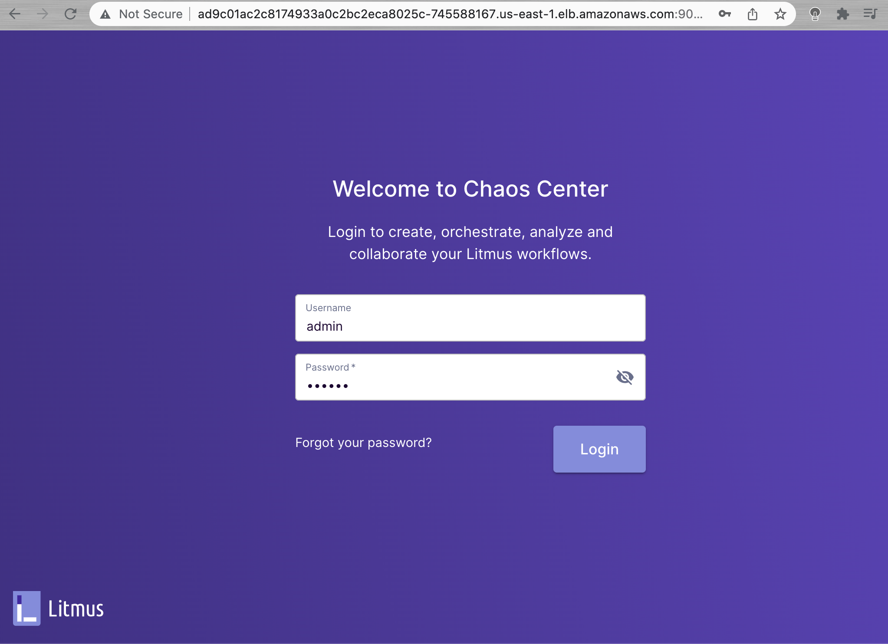

Next, you should see the welcome dashboard. Click on the ChaosAgents link from the left-hand navigation.

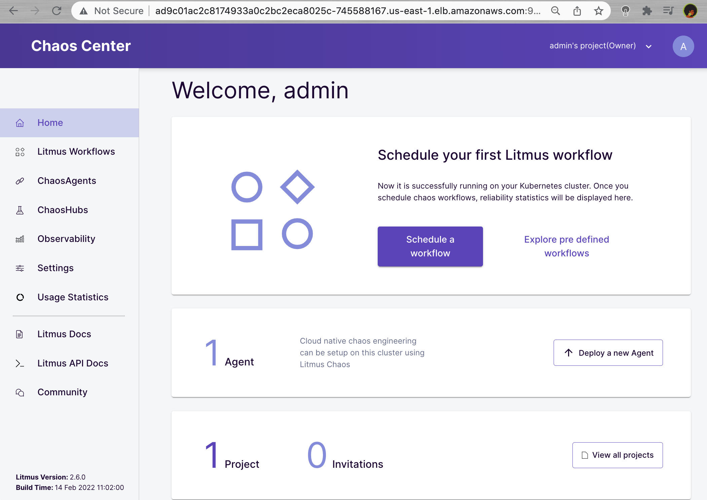


A ChaosAgent represents the target cluster where Chaos would be injected via Litmus. Confirm that Self-Agent is in Active status. Note: It may take a couple of minutes for the Self-Agent to become active.

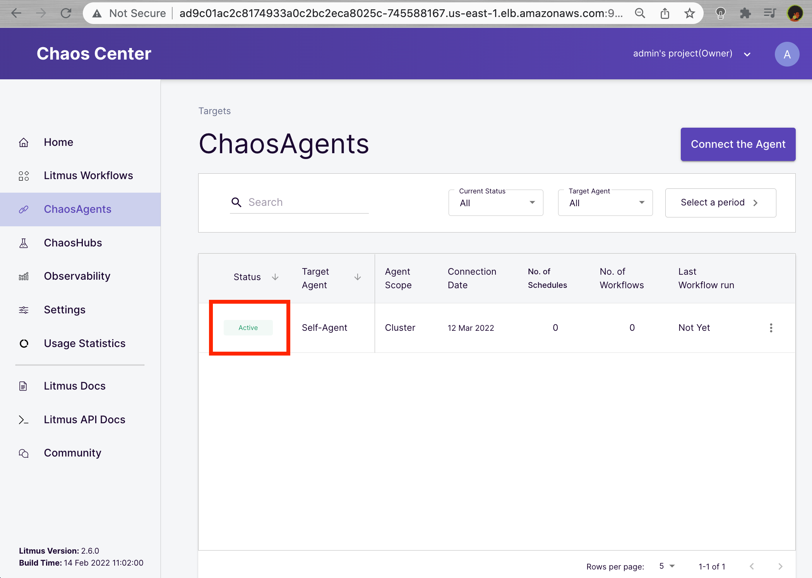


Confirm the agent installation by running the command below.

```bash
$ kubectl get pods -n litmus
```

The output should look like below:

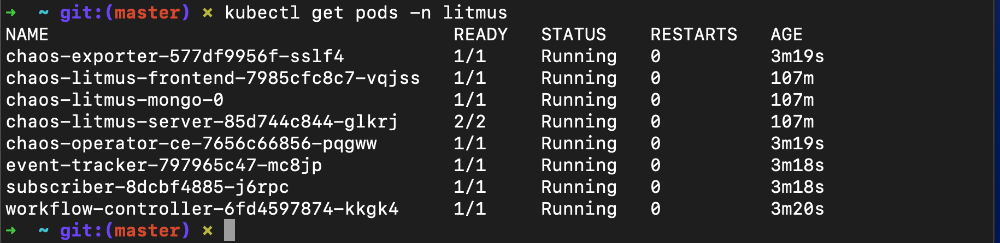


Verify that LitmusChaos CRDs are created:

```bash
$ kubectl get crds | grep chaos
```

You should see a response similar to the one below showing chaosengines, chaosexperiments, and chaosresults.

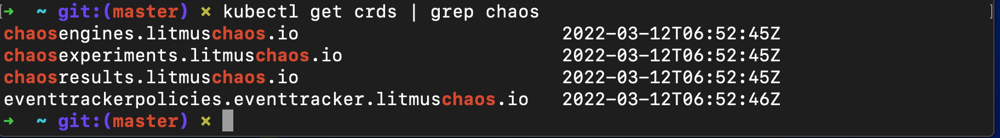

Verify that LitmusChaos API resources are created:

```bash
$ kubectl api-resources | grep chaos
```

You should see a response similar to the one below:

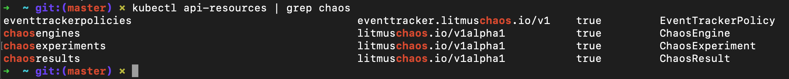

Now that we installed LitmusChaos on the EKS cluster, let’s install a demo application to perform some chaos experiments on.

### STEP 4: Install demo application

Let’s deploy nginx on our cluster using the manifest below to run our chaos experiments on it. Save the manifest as nginx.yaml and apply it.

```bash
cat <<EOF > nginx.yaml
apiVersion: apps/v1
kind: Deployment
metadata:
  name: nginx
  labels:
    app: nginx
spec:
  replicas: 1
  selector:
    matchLabels:
      app: nginx
  template:
    metadata:
      labels:
        app: nginx
    spec:
      containers:
      - image: nginx
        name: nginx
        resources:
          limits:
            cpu: 500m
            memory: 512Mi
          requests:
            cpu: 500m
            memory: 512Mi
EOF
kubectl apply -f nginx.yaml
```

Verify if the nginx pod is running by executing the command below.

```bash
$ kubectl get pods
```

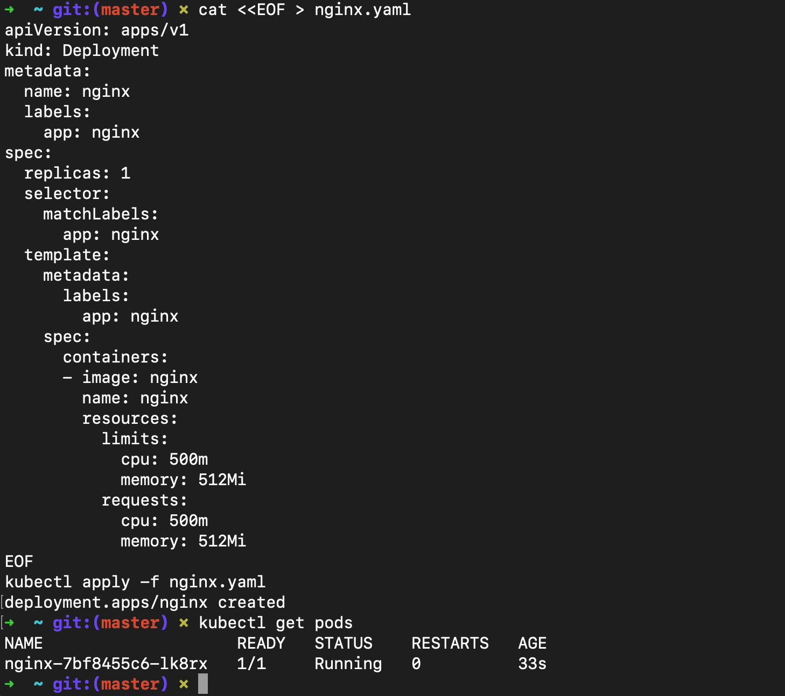

 ### STEP 5: Chaos Experiments

[Litmus ChaosHub](https://hub.litmuschaos.io/) is a public repository where LitmusChaos community members publish their chaos experiments such as **pod-delete,** **node-drain**, **node-cpu-hog**, etc. In this demo walkthrough, we will perform the **pod-autoscaler** experiment from LitmusChaos hub to test cluster auto scaling on Amazon EKS cluster.

### STEP 6: Experiment - Pod Autoscaler

The intent of the pod auto scaler experiment is to check the ability of nodes to accommodate the number of replicas for a deployment. Additionally, the experiment can also be used to check the cluster auto-scaling feature.

**Hypothesis**: Amazon EKS cluster should auto scale when cluster capacity is insufficient to run the pods.

Chaos experiment can be launched using the Litmus ChaosCenter UI by creating a workflow. Navigate to Litmus Chaos Center and select **Litmus Workflows** in the left-hand navigation and then select the **Schedule a workflow** button to create a workflow.


Select the **Self-Agent** radio button on the Schedule a new Litmus workflow page and select **Next**.


Choose **Create a new workflow using the experiments from ChaosHubs** and leave the **Litmus ChaosHub** selected from the dropdown.


Enter a name for your workflow on the next screen.


Let’s add the experiments in the next step. Select **Add a new experiment**; then search for autoscaler and select the **generic/pod-autoscaler** radio button.


Let’s the edit the experiment and change some parameters. Choose the **Edit** icon:


Accept the default values in the General, Target Application, and Define the steady state for this application sections. In the Tune Experiment section, set the TOTAL_CHAOS_DURATION to 180 and REPLICA_COUNT to 10. TOTAL_CHAOS_DURATION sets the desired chaos duration in seconds and REPLICA_COUNT is the number of replicas to scale during the experiment. Select **Finish**.


Then, choose **Next** and accept the defaults for reliability score and schedule the experiment to run now. Finally, select **Finish** to run the chaos experiment.


The chaos experiment is now scheduled to run and you can look at the status by clicking on the workflow.


From the ChaosResults, you will see that the experiment failed because there was no capacity in the cluster to run 10 replicas.


### STEP 7: Install Cluster Autoscaler

Cluster Autoscaler for AWS provides integration with Auto Scaling groups. Cluster Autoscaler will attempt to determine the CPU, memory, and GPU resources provided by an Auto Scaling group based on the instance type specified in its launch configuration or launch template.

Create an IAM OIDC identity provider for your cluster with the following command.

```bash
eksctl utils associate-iam-oidc-provider --cluster eks-litmus-demo --approve
```

### STEP 8: Create an IAM policy and role

Create an IAM policy that grants the permissions that the Cluster Autoscaler requires to use an IAM role.

```bash
cat <<EOF > cluster-autoscaler-policy.json
{
    "Version": "2012-10-17",
    "Statement": [
        {
            "Action": [
                "autoscaling:DescribeAutoScalingGroups",
                "autoscaling:DescribeAutoScalingInstances",
                "autoscaling:DescribeLaunchConfigurations",
                "autoscaling:DescribeTags",
                "autoscaling:SetDesiredCapacity",
                "autoscaling:TerminateInstanceInAutoScalingGroup",
                "ec2:DescribeLaunchTemplateVersions"
            ],
            "Resource": "*",
            "Effect": "Allow"
        }
    ]
}
EOF

aws iam create-policy \
    --policy-name AmazonEKSClusterAutoscalerPolicy \
    --policy-document file://cluster-autoscaler-policy.json
```

Create an IAM role and attach an IAM policy to it using eksctl.

```bash
eksctl create iamserviceaccount \
    --cluster=eks-litmus-demo \
    --namespace=kube-system \
    --name=cluster-autoscaler \
    --attach-policy-arn="arn:aws:iam::$ACCOUNT_ID:policy/AmazonEKSClusterAutoscalerPolicy" \
    --override-existing-serviceaccounts \
    --approve
```

Make sure your service account with the ARN of the IAM role is annotated.

If you get an error, use the following guide:
https://docs.aws.amazon.com/eks/latest/userguide/enable-iam-roles-for-service-accounts.html

```bash
$ kubectl describe sa cluster-autoscaler -n kube-system
```


### STEP 9: Deploy the Cluster Autoscaler

Download the Cluster Autoscaler manifest.

```bash
curl -o cluster-autoscaler-autodiscover.yaml https://raw.githubusercontent.com/kubernetes/autoscaler/master/cluster-autoscaler/cloudprovider/aws/examples/cluster-autoscaler-autodiscover.yaml
```

Edit the downloaded file to replace <YOUR CLUSTER NAME> with the cluster name (eks-litmus-demo) and add the following two lines.

```bash
- --balance-similar-node-groups
- --skip-nodes-with-system-pods=false
```

The edited section should look like the following:

```bash
command:
  - ./cluster-autoscaler
  - --v=4
  - --stderrthreshold=info
  - --cloud-provider=aws
  - --skip-nodes-with-local-storage=false
  - --expander=least-waste
  - --node-group-auto-discovery=asg:tag=k8s.io/cluster-autoscaler/enabled,k8s.io/cluster-autoscaler/eks-litmus-demo
  - --balance-similar-node-groups
  - --skip-nodes-with-system-pods=false
```

Apply the manifest file to the cluster.

```bash
kubectl apply -f cluster-autoscaler-autodiscover.yaml
```

Patch the deployment to add the `cluster-autoscaler.kubernetes.io/safe-to-evict` annotation to the Cluster Autoscaler pods with the following command.

```bash
kubectl patch deployment cluster-autoscaler \
-n kube-system \
-p '{"spec":{"template":{"metadata":{"annotations":{"cluster-autoscaler.kubernetes.io/safe-to-evict": "false"}}}}}'
```

Find the latest Cluster Autoscaler version that matches the Kubernetes major and minor versions of your cluster. For example, if the Kubernetes version of your cluster is 1.21, find the latest Cluster Autoscaler release that begins with 1.21. Record the semantic version number (1.21.n) for that release to use in the next step.

```bash
export K8S_VERSION=$(kubectl version --short | grep 'Server Version:' | sed 's/[^0-9.]*\([0-9.]*\).*/\1/' | cut -d. -f1,2)export AUTOSCALER_VERSION=$(curl -s "https://api.github.com/repos/kubernetes/autoscaler/releases" | grep '"tag_name":' | grep -m1 ${K8S_VERSION} | sed 's/[^0-9.]*\([0-9.]*\).*/\1/')
```

Set the Cluster Autoscaler image tag to the version that was exported in the previous step with the following command.

```bash
kubectl set image deployment cluster-autoscaler \
-n kube-system \
cluster-autoscaler=k8s.gcr.io/autoscaling/cluster-autoscaler:${AUTOSCALER_VERSION}
```

After you have deployed the Cluster Autoscaler, you can view the logs and verify that it’s monitoring your cluster load.

View your Cluster Autoscaler logs with the following command.

```bash
kubectl -n kube-system logs -f deployment.apps/cluster-autoscaler
```

Now that we have deployed the Cluster Autoscaler, let’s rerun the same experiment by navigating to Litmus Workflows, then the Schedules tab. Select the three dots menu icon for the workflow and select **Rerun Schedule**.


This time, the Cluster Autoscaler will add additional nodes to the cluster, and the experiment will pass, which proves our hypothesis.


#### Experiment Conclusion

Autoscaling the pod triggered the ClusterAautoscaler as a result of insufficient capacity, and a new node was added to the cluster, and the pods were successfully provisioned.

#### Next steps

From the above walkthrough, we saw how to get started with Chaos Engineering using LitmusChaos on Amazon EKS cluster. There are additional experiments such as **pod-delete**, **node-drain**, **node-cpu-hog**, and so on that you can integrate with a CI/CD pipeline to perform Chaos Engineering. LitmusChaos also supports **gitops** and advanced chaos workflows using **Chaos Workflows**.

-----------------------------------------------------------------------------------------
## PART 2: pod-delete

Pod delete contains chaos to disrupt state of kubernetes resources. Experiments can inject random pod delete failures against specified application.

- Causes (forced/graceful) pod failure of random replicas of an application deployment.
- Tests deployment sanity (replica availability & uninterrupted service) and recovery workflows of the application pod.


**PRE-REQUISITES:**

### **STEP 1: Install Litmus Operator**

This is a tool for injecting Chaos Experiments

**Installation[](https://docs.litmuschaos.io/docs/getting-started/installation/#installation)**

Users looking to use Litmus for the first time have two options available to them today. One way is to use a hosted Litmus service like [ChaosNative Litmus Cloud](https://cloud.chaosnative.com/). Alternatively, users looking for some more flexibility can install Litmus into their own Kubernetes cluster.

Users choosing the self-hosted option can refer to our Install and Configure docs for installing alternate versions and more detailed instructions.

- Self-Hosted
- Hosted (Beta)

Installation of Self-Hosted Litmus can be done using either of the below 

**methods** :

[Helm3](https://docs.litmuschaos.io/docs/getting-started/installation/#install-litmus-using-helm) chart 

[Kubectl](https://docs.litmuschaos.io/docs/getting-started/installation/#install-litmus-using-kubectl) yaml spec file. 

Refer to the below details for Self-Hosted Litmus installation.

### STEP 2: Install Litmus using Helm[](https://docs.litmuschaos.io/docs/getting-started/installation/#install-litmus-using-helm)

The helm chart will install all the required service account configuration and ChaosCenter.

The following steps will help you install Litmus ChaosCenter via helm.

### STEP 3: Add the litmus helm repository[](https://docs.litmuschaos.io/docs/getting-started/installation/#step-1-add-the-litmus-helm-repository)

```bash
helm repo add litmuschaos https://litmuschaos.github.io/litmus-helm/helm repo list
```

### STEP 4: Create the namespace on which you want to install Litmus ChaosCenter[](https://docs.litmuschaos.io/docs/getting-started/installation/#step-2-create-the-namespace-on-which-you-want-to-install-litmus-chaoscenter)

- The ChaosCenter can be placed in any namespace, but for this scenario we are choose `litmus` as the namespace.

```bash
kubectl create ns litmus
```

### STEP 5: Install Litmus ChaosCenter[](https://docs.litmuschaos.io/docs/getting-started/installation/#step-3-install-litmus-chaoscenter)

```bash
helm install chaos litmuschaos/litmus --namespace=litmus
```

**Expected Output**

```bash
NAME: chaosLAST DEPLOYED: Tue Jun 15 19:20:09 2021NAMESPACE: litmusSTATUS: deployedREVISION: 1TEST SUITE: NoneNOTES:Thank you for installing litmus 😀Your release is named chaos and its installed to namespace: litmus.Visit https://docs.litmuschaos.io to find more info.
```

> **Note**: Litmus uses Kubernetes CRDs to define chaos intent. Helm3 handles CRDs better than Helm2. Before you start running a chaos experiment, verify if Litmus is installed correctly.
> 

### STEP 6: **Install Litmus using kubectl**[](https://docs.litmuschaos.io/docs/getting-started/installation/#install-litmus-using-kubectl)

### STEP 7: **Install Litmus ChaosCenter**[](https://docs.litmuschaos.io/docs/getting-started/installation/#install-litmus-chaoscenter)

Applying the manifest file will install all the required service account configuration and ChaosCenter.

`kubectl apply -f https://litmuschaos.github.io/litmus/2.6.0/litmus-2.6.0.yaml`


## STEP 7: Verification

- **Verify your installation**[](https://docs.litmuschaos.io/docs/getting-started/installation/#verify-your-installation)

- **Verify if the frontend, server, and database pods are running**[](https://docs.litmuschaos.io/docs/getting-started/installation/#verify-if-the-frontend-server-and-database-pods-are-running)

- Check the pods in the namespace where you installed Litmus:
    
    **Expected Output**
    
    `kubectl get pods -n litmus`
    
    `NAME                                    READY   STATUS  RESTARTS  AGElitmusportal-frontend-97c8bf86b-mx89w   1/1     Running 2         6m24slitmusportal-server-5cfbfc88cc-m6c5j    2/2     Running 2         6m19smongo-0                                 1/1     Running 0         6m16s`
    
- Check the services running in the namespace where you installed Litmus:
    
    **Expected Output**
    
    `kubectl get svc -n litmus`
    
    `NAME                            TYPE        CLUSTER-IP      EXTERNAL-IP PORT(S)                       AGElitmusportal-frontend-service   NodePort    10.100.105.154  <none>      9091:30229/TCP                7m14slitmusportal-server-service     NodePort    10.100.150.175  <none>      9002:30479/TCP,9003:31949/TCP 7m8smongo-service                   ClusterIP   10.100.226.179  <none>      27017/TCP                     7m6s`
    

------------------------------------------------------------------------------------

## PART 3: **Accessing the ChaosCenter**[](https://docs.litmuschaos.io/docs/getting-started/installation/#accessing-the-chaoscenter)

### **STEP 1:** To setup and login to ChaosCenter expand the available services just created and copy the `PORT` of the `litmusportal-frontend-service` service

`kubectl get svc -n litmus`

**Expected Output**

`NAME                            TYPE        CLUSTER-IP       EXTERNAL-IP   PORT(S)                         AGEchaos-litmus-portal-mongo       ClusterIP   10.104.107.117   <none>        27017/TCP                       2mlitmusportal-frontend-service   NodePort    10.101.81.70     <none>        9091:30385/TCP                  2mlitmusportal-server-service     NodePort    10.108.151.79    <none>        9002:32456/TCP,9003:31160/TCP   2m`Copy

> **Note**: In this case, the PORT for litmusportal-frontend-service is 30385. Yours will be different.
> 

Once you have the PORT copied in your clipboard, simply use your IP and PORT in this manner `<NODEIP>:<PORT>` to access the Litmus ChaosCenter.

For example:

`http://172.17.0.3:30385/`

> Where 172.17.0.3 is my NodeIP and 30385 is the frontend service PORT. If using a LoadBalancer, the only change would be to provide a <LoadBalancerIP>:<PORT>. Learn more about how to access ChaosCenter with LoadBalancer
> 

You should be able to see the Login Page of Litmus ChaosCenter. The **default credentials** are

`Username: admin` 

`Password: litmus`


By default you are assigned with a default project with Owner permissions.


### STEP 2: **Verify Successful Registration of the Self Agent**[](https://docs.litmuschaos.io/docs/getting-started/installation/#verify-successful-registration-of-the-self-agent)

Once the project is created, the cluster is automatically registered as a chaos target via installation of [ChaosAgents](https://docs.litmuschaos.io/docs/getting-started/resources#chaosagents). This is represented as [Self-Agent](https://docs.litmuschaos.io/docs/getting-started/resources#types-of-chaosagents) in [ChaosCenter](https://docs.litmuschaos.io/docs/getting-started/resources#chaoscenter).

`kubectl get pods -n litmus`

`NAME                                     READY   STATUS    RESTARTS   AGEchaos-exporter-547b59d887-4dm58          1/1     Running   0          5m27schaos-operator-ce-84ddc8f5d7-l8c6d       1/1     Running   0          5m27sevent-tracker-5bc478cbd7-xlflb           1/1     Running   0          5m28slitmusportal-frontend-97c8bf86b-mx89w    1/1     Running   0          15mlitmusportal-server-5cfbfc88cc-m6c5j     2/2     Running   1          15mmongo-0                                  1/1     Running   0          15msubscriber-958948965-qbx29               1/1     Running   0          5m30sworkflow-controller-78fc7b6c6-w82m7      1/1     Running   0          5m32s`

### **STEP 3:** **Install this Chaos Experiment**

You can install the Chaos Experiment using the following command

```bash
kubectl apply -f https://hub.litmuschaos.io/api/chaos/2.6.0?file=charts/generic/pod-delete/experiment.yaml
```
### **STEP 4:** **Setup Service Account (RBAC)**

Create a service account using the following command

```bash
$ kubectl apply -f https://hub.litmuschaos.io/api/chaos/2.6.0?file=charts/generic/pod-delete/rbac.yaml
```

### **STEP 5:** **Sample Chaos Engine**

Create a file and name it `engine.yaml`

Place the below code in the `engine.yaml` file

```bash
apiVersion: litmuschaos.io/v1alpha1
kind: ChaosEngine
metadata:
  name: nginx-chaos
  namespace: default
spec:
  appinfo:
    appns: 'default'
    applabel: 'app=nginx'
    appkind: 'deployment'
  # It can be active/stop
  engineState: 'active'
  chaosServiceAccount: pod-delete-sa
  experiments:
    - name: pod-delete
      spec:
        components:
          env:
            # set chaos duration (in sec) as desired
            - name: TOTAL_CHAOS_DURATION
              value: '30'

            # set chaos interval (in sec) as desired
            - name: CHAOS_INTERVAL
              value: '10'
              
            # pod failures without '--force' & default terminationGracePeriodSeconds
            - name: FORCE
              value: 'false'

             ## percentage of total pods to target
            - name: PODS_AFFECTED_PERC
              value: ''
```

Once you download the yaml you can apply the yaml using the below command

```bash
$ kubectl apply -f engine.yaml
```

### **STEP 6:** Node-drain

Drain the node where application pod is scheduled


**PRE-REQUISITES:**

**Install Litmus Operator**: a tool for injecting Chaos Experiments

**Install this Chaos Experiment**

You can install the Chaos Experiment using the following command

```bash
$ kubectl apply -f https://hub.litmuschaos.io/api/chaos/2.6.0?file=charts/generic/node-drain/experiment.yaml
```

### STEP 7: **Setup Service Account (RBAC)**

Create a service account using the following command

```bash
$ kubectl apply -f https://hub.litmuschaos.io/api/chaos/2.6.0?file=charts/generic/node-drain/rbac.yaml
```

Create a file and name it `generic.yaml`

Place the below code in the `generic.yaml` file

```bash
apiVersion: litmuschaos.io/v1alpha1
kind: ChaosEngine
metadata:
  name: nginx-chaos
  namespace: default
spec:
  # It can be active/stop
  engineState: 'active'
  #ex. values: ns1:name=percona,ns2:run=nginx 
  auxiliaryAppInfo: ''
  chaosServiceAccount: node-drain-sa
  experiments:
    - name: node-drain
      spec:
        components:
        # nodeSelector: 
        #   # provide the node labels
        #   kubernetes.io/hostname: 'node02'        
          env:
            - name: TOTAL_CHAOS_DURATION
              value: '60'
              
            # enter the target node name
            - name: TARGET_NODE
              value: ''
```

Once you download the yaml you can apply the yaml using the below command

```bash
$ kubectl apply -f generic.yaml
```
------------------------------------------------------------------------------------------
## PART 4: **node-cpu-hog**

Node CPU hog contains chaos to disrupt the state of Kubernetes resources.

Node CPU hog contains chaos to disrupt the state of Kubernetes resources. Experiments can inject a CPU spike on a node where the application pod is scheduled.

- CPU hog on a particular node where the application deployment is available.
- After test, the recovery should be manual for the application pod and node in case they are not in an appropriate state.

**PRE-REQUISITES:**

- **Install Litmus Operator**: a tool for injecting Chaos Experiments

- **Install this Chaos Experiment**

The Chaos Experiment can be instlled using the following command:

```
$ kubectl apply -f https://hub.litmuschaos.io/api/chaos/2.6.0?file=charts/generic/node-cpu-hog/experiment.yaml
```

### STEP 1: **Setup Service Account (RBAC)**

Create a service account using the following command

```bash
$ kubectl apply -f https://hub.litmuschaos.io/api/chaos/2.6.0?file=charts/generic/node-cpu-hog/rbac.yaml
```

### STEP 2: Create a file and name it `node-cpu.yaml`

Place the below code in the node-cpu `node-cpu.yaml` file

```bash
apiVersion: litmuschaos.io/v1alpha1
kind: ChaosEngine
metadata:
  name: nginx-chaos
  namespace: default
spec:
  # It can be active/stop
  engineState: 'active'
  #ex. values: ns1:name=percona,ns2:run=nginx 
  auxiliaryAppInfo: ''
  chaosServiceAccount: node-cpu-hog-sa
  experiments:
    - name: node-cpu-hog
      spec:
        components:
          env:
            # set chaos duration (in sec) as desired
            - name: TOTAL_CHAOS_DURATION
              value: '60'
            
            - name: NODE_CPU_CORE
              value: ''
            
            ## percentage of total nodes to target
            - name: NODES_AFFECTED_PERC
              value: ''

            # provide the comma separated target node names
            - name: TARGET_NODES
              value: ''
```

### STEP 3: Apply yaml command

Once you download the yaml you can apply the yaml using the below command

```bash
$ kubectl apply -f node-cpu.yaml
```
------------------------------------------------------------------------------------------

# Clean up

we will begin the clean up process, so that we do not get charged.
## Congratulations! 

Nice work! You have successfully completed the project.
