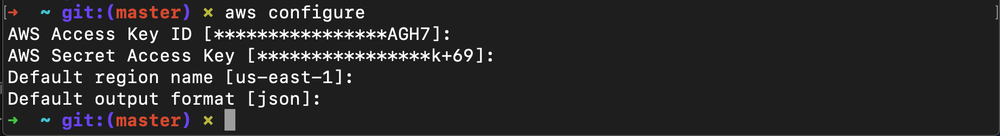
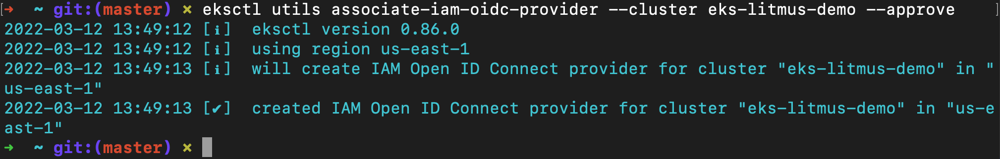
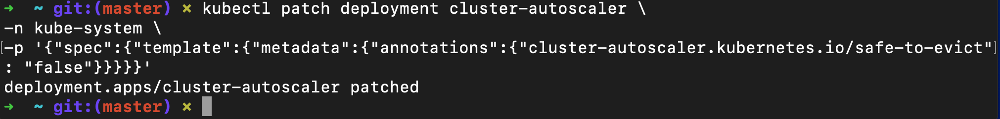
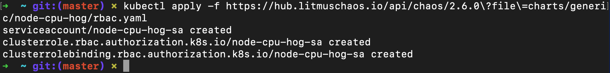

# LitmusChaos-on-Amazon-EKS

Hello and Welcome to the _LitmusChaos-on-Amazon-EKS_ project!

# Overview:

Greetings! My name is Cecilia, and in this amazing project, I will show you how to utilize the principles of Chaos Engineering with LitmusChaos on Amazon EKS. Let's begin by understanding the concept of Chaos Engineering:

In a nutshell, Chaos Engineering is all about preparing for the worst. It is a methodology of experimenting on a system to determine how well it can withstand disruptive conditions in production. These disruptions often resemble a real-life incident. In other words, Chaos Engineering creates _chaos_ in an automated and controlled environment, to help engineers discover and understand weaknesses in systems.

LitmusChaos will be used to create the testing environment. [LitmusChaos](https://litmuschaos.io/) is a cloud-native Chaos Engineering framework, which is designed to work with Kubernetes. [Kubernetes](https://kubernetes.io/) is a portable, extensible, open-source platform which is used for managing containerized workloads and services. 

We will be using AWS EKS, which stands for Amazon Elastic Kubernetes Service. This managed service that will allow us run Kubernetes on AWS without needing to install, operate, and/or maintain our own Kubernetes control plane or nodes!

Litmus takes a cloud-native approach to create, manage, and monitor chaos. 

The Chaos is orchestrated using the following Kubernetes custom resource definitions (CRDs):

- **ChaosEngine**: A resource that links Kubernetes application or Kubernetes node to a ChaosExperiment.
- **ChaosExperiment**: A resource that groups the configuration parameters of a chaos experiment.
- **ChaosResult**: A resource that records the results of a ChaosExperiment.

Now that we've covered the tools we're working with, let's get started!

-----------------------------------------------------------------------------------------
## PART 1: Getting Started

We will begin by creating an Amazon EKS cluster with managed nodes. In order to achieve this, we will install LitmusChaos and a demo application. Next, we will install chaos experiments which will run on the demo application. Lastly, we will observe the behavior.

Prior to beginning the project, we must ensure that we have the following software installed on our local PC:

- [AWS CLI version 2](https://docs.aws.amazon.com/cli/latest/userguide/install-cliv2.html)
- [eksctl](https://docs.aws.amazon.com/eks/latest/userguide/eksctl.html)
- [kubectl](https://docs.aws.amazon.com/eks/latest/userguide/install-kubectl.html)
- [Helm](https://www.eksworkshop.com/beginner/060_helm/helm_intro/install/index.html)

Please click each of the links above, then follow each  guide to install the software on your local PC.

Once you have installed the `AWS CLI version 2`, check the version on Terminal using the following command:

```
$ aws --version
```


To configure your AWS account from your Terminal, use the following command:

```
$ aws configure
```


sign in as the IAM user to the AWS management console. If you do not have an AWS account, please create one for free at [aws.amazon.com](https://aws.amazon.com).


After you have installed `eksctl`, check the version on Terminal using the following command:

```
$ eksctl version
```


After you have installed `kubectl`, check the version on Terminal using the following command:

```
$ kubectl version --short --client
```

Lastly, install `Helm` using the following command:

```bash
curl -sSL https://raw.githubusercontent.com/helm/helm/master/scripts/get-helm-3 | bash
```

After you have installed `Helm`, check the version on Terminal using the following command:

```bash
$ helm version --short
```


### STEP 1: Create an EKS Cluster

Create a new EKS cluster using eksctl using the following commands:

- Open Terminal and run the following command:
    
    ```bash
    export ACCOUNT_ID=$(aws sts get-caller-identity --output text --query Account)
    export AWS_REGION=us-east-1 #change as per your region of choice
    ```
    
- Create a .yaml file using the following command:

```bash
$ touch cluster.yaml
```

- Next, using your editor of choice, edit the `cluster.yaml` file and place the following code within the file:

```bash
---
apiVersion: eksctl.io/v1alpha5
kind: ClusterConfig
metadata:
  name: eks-litmus-demo
  region: ${AWS_REGION}
  version: "1.21"
managedNodeGroups:
  - instanceType: m5.large
    amiFamily: AmazonLinux2
    name: eks-litmus-demo-ng
    desiredCapacity: 2
    minSize: 2
    maxSize: 4
```

_Be sure to replace ${AWS_REGION} with your preferred region._


- Next, run the following command to create the cluster:

```
$ eksctl create cluster -f cluster.yaml
```

Now take a moment to sit back and relax. Your brand new cluster awaits! Please be patient, this may take several minutes.


You can also check the status of your cluster on the [AWS Console](https://console.aws.amazon.com/). Sign in to your account and then navigate to `CloudFormation` service. Click `stacks` to view your cluster in progress.


Once it has been completed, the status will change to `CREATE_COMPLETE`.


Once it has been created, add permissions to the cluster by creating a nodegroup. Here is the procedure:

- Navigate to the IAM service on the AWS Management Console and select the `Roles` section within the **Access Management** category. 


- Next, select `AWS Service` and then select `EC2` as the use case.


- Next, add each of the following permission policies. Once you have added them, click **Next**:

      AmazonEKSWorkerNodePolicy
      AmazonEKS_CNI_Policy
      AmazonEC2ContainerRegistryReadOnly


- Make sure that all of the permissions have been added!


- Next,enter your preferred Role Name and/or Description.


- Once you have created the role, you will see a confirmation banner on the top of your screen, as shown here:


- After you have completed the steps, navigate to the cluster on `Amazon EKS`. Click the `Compute` tab and then select `Add Node Group`.

- Add the newly created node group to your cluster. Once you have added it, you should see the node group in your cluster:


### STEP 3: Install LitmusChaos

Now we will install LitmusChaos on an Amazon EKS cluster using a Helm chart. The Helm chart will install the needed CRDs, service account configuration, and ChaosCenter!

- To begin, open Terminal, then add the Litmus Helm repository using the following command below:

```bash
$ helm repo add litmuschaos https://litmuschaos.github.io/litmus-helm/
```

- Next, confirm that you have the Litmus-related Helm charts:

```bash
$ helm search repo litmuschaos
```

- The output should look like below:


- Create a namespace to install LitmusChaos.

```bash
$ kubectl create ns litmus
```

These Litmus Helm chart will create NodePort services. In order to access the Litmus Chaoscenter using a Load balancer, we must first make some configurations.

- To begin this process, run the following command:

```bash
cat <<EOF > override-litmus.yaml
portal:
  server:
    service:
      type: ClusterIP
  frontend:
    service:
      type: LoadBalancer
EOF

helm install chaos litmuschaos/litmus --namespace=litmus -f override-litmus.yaml
```


- Next, verify that LitmusChaos is running using the following command:

```bash
$ kubectl get pods -n litmus
```

After a moment, you should see the `STATUS` displayed as **Running**, similar to the the image below:


- Next, run the following command:

```bash
$ kubectl get svc -n litmus
```


- Now that we've completed the process, let's navigate to the LitmusChaos website. Use the following commands to obtain the unique URL link:

```bash
$ export LITMUS_FRONTEND_SERVICE=`kubectl get svc chaos-litmus-frontend-service -n litmus --output jsonpath='{.status.loadBalancer.ingress[0].hostname}:{.spec.ports[0].port}'`

$ echo "Litmus ChaosCenter is available at http://$LITMUS_FRONTEND_SERVICE"
```

The output should look something like this:


- Copy the `http://` link provided, and enter it into the URL of your web browser.

- On the main Litmus ChaosCenter UI page, sign in using the following default credentials:
  - **username**: `admin`
  - **password**: `litmus` 

After you have signed in, you will be prompted to set a new Password for your next sign in. Create a new password, or skip for now.


- Next, you should see the welcome dashboard. Click on the ChaosAgents link from the left-hand navigation.


A ChaosAgent represents the target cluster where Chaos would be injected via Litmus. Confirm that Self-Agent is in Active status. 

_**Note**: It may take a couple of minutes for the Self-Agent to become active._


- Navigate back to your Terminal, and confirm the agent installation by running the command below:

```bash
$ kubectl get pods -n litmus
```

The output should look something like this:


- Verify that LitmusChaos CRDs have been created using the following command:

```bash
$ kubectl get crds | grep chaos
```

You should see a response that displays `ChaosEngines`, `ChaosExperiments`, and `ChaosResults`, as shown below:


- Next, verify that LitmusChaos API resources have been created using the following command:

```bash
$ kubectl api-resources | grep chaos
```

You should see a response similar to the one below:


### STEP 4: Install demo application

Now that we installed LitmusChaos on the EKS cluster, let’s install a demo application for our experiments!

First, we will deploy `Nginx` on our cluster. Create a file called `nginx.yaml` by running the following command:

```bash
cat <<EOF > nginx.yaml
apiVersion: apps/v1
kind: Deployment
metadata:
  name: nginx
  labels:
    app: nginx
spec:
  replicas: 1
  selector:
    matchLabels:
      app: nginx
  template:
    metadata:
      labels:
        app: nginx
    spec:
      containers:
      - image: nginx
        name: nginx
        resources:
          limits:
            cpu: 500m
            memory: 512Mi
          requests:
            cpu: 500m
            memory: 512Mi
EOF
kubectl apply -f nginx.yaml
```

- Next, verify whether the Nginx pod is running by executing the command:

```bash
$ kubectlget pods
```

Here is the output you can expect to receive:


### STEP 5: Chaos Experiment - Pod Autoscaler

Now that we have installed LitmusChaos as well as the demo application, let's begin our experiments. 

[Litmus ChaosHub](https://hub.litmuschaos.io/) is a public repository where LitmusChaos community members publish their chaos experiments! Examples of these experiments include:
- **pod-delete**
- **node-drain**
- **node-cpu-hog**
_and many more..._

We will utilize the **pod-autoscaler** experiment to test cluster auto scaling on Amazon EKS cluster.


The `pod-autoscaler` experiment will be used to examine how effectively the nodes can accommodate the number of replicas for a deployment. It will also be used to examine the cluster's auto-scaling feature overall.

The hypothesis is that Amazon EKS cluster should auto scale when cluster capacity is insufficient to run the pods.

Let's test this hypothesis!

- Begin by navigating back to the Litmus Chaos Center on your web browser. Select **Litmus Workflows** in the left-hand navigation, and then select the **Schedule a workflow** button to create a workflow.


- Next, select the **Self-Agent** radio button on the _Schedule a new Litmus workflow_ page and then select **Next**.


- Next, select **Create a new workflow using the experiments from ChaosHubs** and leave the **Litmus ChaosHub** selected from the dropdown.


- Enter a name for your workflow on the next screen.


- Next, select **Add a new experiment**; then search for autoscaler in the searchbar. Select the **`generic/pod-autoscaler`** button.


Great job! Now let's edit the experiment and change some parameters.

- To edit the experiment and change some parameters, simply choose the **Edit** icon:


- Keep all of the values as default in the following sections (_skip these sections_):
  - `General`
  - `Target Application`
  - `Define the steady state for this application`

- Once you reach the `Tune Experiment` section, set the following parameters and then select **Finish** at the bottom:
  - `TOTAL_CHAOS_DURATION` = 180 
  - `REPLICA_COUNT` = 10. 


- After that, choose **Next** and accept the default values for the `reliability score`, then schedule the experiment to run now. 

- Finally, select **Finish** to run the chaos experiment.


Congrats! You have created your new Litmus workflow!


Nice work! The chaos experiment is now scheduled to run! You can view status by navigating to the workflow page, as shown here:


After a few moments, you will observe that the experiment failed. The reason for this is because there was not enough capacity in the cluster to run 10 replicas.

 


### STEP 6: Install Cluster Autoscaler

Now, we will install the cluster Autoscaler. This will integrate with Auto Scaling groups on AWS.

- From the command line, create an IAM OIDC identity provider for your cluster with the following command:

```bash
$ eksctl utils associate-iam-oidc-provider --cluster eks-litmus-demo --approve
```

### STEP 7: Create an IAM policy and role

- Next, we will create an IAM policy from the command line. This policy will grant the permissions that the Cluster Autoscaler needs to use an IAM role.

```bash
cat <<EOF > cluster-autoscaler-policy.json
{
    "Version": "2012-10-17",
    "Statement": [
        {
            "Action": [
                "autoscaling:DescribeAutoScalingGroups",
                "autoscaling:DescribeAutoScalingInstances",
                "autoscaling:DescribeLaunchConfigurations",
                "autoscaling:DescribeTags",
                "autoscaling:SetDesiredCapacity",
                "autoscaling:TerminateInstanceInAutoScalingGroup",
                "ec2:DescribeLaunchTemplateVersions"
            ],
            "Resource": "*",
            "Effect": "Allow"
        }
    ]
}
EOF

aws iam create-policy \
    --policy-name AmazonEKSClusterAutoscalerPolicy \
    --policy-document file://cluster-autoscaler-policy.json
```

- Next, create an IAM role and attach an IAM policy to it using eksctl.

```bash
eksctl create iamserviceaccount \
    --cluster=eks-litmus-demo \
    --namespace=kube-system \
    --name=cluster-autoscaler \
    --attach-policy-arn="arn:aws:iam::$ACCOUNT_ID:policy/AmazonEKSClusterAutoscalerPolicy" \
    --override-existing-serviceaccounts \
    --approve
```

_**PLEASE NOTE**: Ensure that your service account corresponds with the ARN of the IAM role._


- Finally, ensure that your service account with the ARN of the IAM role is annotated.

```bash
$ kubectl describe sa cluster-autoscaler -n kube-system
```


### STEP 8: Deploy the Cluster Autoscaler

- In Terminal, run the following command to download the Cluster Autoscaler:

```
curl -o cluster-autoscaler-autodiscover.yaml https://raw.githubusercontent.com/kubernetes/autoscaler/master/cluster-autoscaler/cloudprovider/aws/examples/cluster-autoscaler-autodiscover.yaml
```

- Next, edit the downloaded file by replacing <YOUR CLUSTER NAME> with the cluster name (eks-litmus-demo). Also, add the following two lines in the `command` section:

```bash
- --balance-similar-node-groups
- --skip-nodes-with-system-pods=false
```


- To apply the changes, run the following command:

```bash
kubectl apply -f cluster-autoscaler-autodiscover.yaml
```


- Next, use the following command to patch the deployment. This will add the `cluster-autoscaler.kubernetes.io/safe-to-evict` annotation to the Cluster Autoscaler pods:

```bash
kubectl patch deployment cluster-autoscaler \
-n kube-system \
-p '{"spec":{"template":{"metadata":{"annotations":{"cluster-autoscaler.kubernetes.io/safe-to-evict": "false"}}}}}'
```


- Next, locate the latest Cluster Autoscaler version that matches both the Kubernetes major and minor versions of your cluster. 
(_In my case, the Kubernetes version of my cluster is 1.21, therefore, I will use the Cluster Autoscaler release version 1.21)

```bash
export K8S_VERSION=$(kubectl version --short | grep 'Server Version:' | sed 's/[^0-9.]*\([0-9.]*\).*/\1/' | cut -d. -f1,2)export AUTOSCALER_VERSION=$(curl -s "https://api.github.com/repos/kubernetes/autoscaler/releases" | grep '"tag_name":' | grep -m1 ${K8S_VERSION} | sed 's/[^0-9.]*\([0-9.]*\).*/\1/')
```

Next, use the following command to set the Cluster Autoscaler image deployment:

```bash
kubectl set image deployment cluster-autoscaler \
-n kube-system \
cluster-autoscaler=k8s.gcr.io/autoscaling/cluster-autoscaler:${AUTOSCALER_VERSION}
```

- View your Cluster Autoscaler logs with the following command:

```bash
kubectl -n kube-system logs -f deployment.apps/cluster-autoscaler
```

Here's what you should see after running the aforementioned commands:


Great job! Now that the Cluster Autoscaler has been deployed, let’s rerun the same experiment.

- Begin by navigating back to Litmus Workflows on your web browser, then select the `Schedules` tab. Select the three dots menu icon for the workflow and select **Rerun Schedule**.


Please wait a few moments for the workflow to process.

Once completed, the Cluster Autoscaler will create additional nodes to the cluster, and the experiment will pass! 


Excellent job! We've witnessed how Chaos Engineering works using LitmusChaos on Amazon EKS cluster!

Autoscaling the pod triggered the `ClusterAautoscaler`, due to  insufficient capacity. This caused the experiment to fail. However, once a new node was added to the cluster, the pods were successfully created, and the experiment passed!

There are even more experiments that we could examine, such as **pod-delete**, **node-drain**,and **node-cpu-hog**! All of these experiments can be integrated across a CI/CD pipeline to perform Chaos Engineering. 

In the next section, let's explore some additional experiments. 

-----------------------------------------------------------------------------------------
## PART 2: Additional Chaos Experiments

Additional Chaos experiments can be used to disrupt state of our resources. This can be useful for testing deployment resilliency or overall recovery workflows of the application.

As we delve deeper into difference experiments, you can observe and manage the changed state of the cluster using an app called `Lens 5`, which an the Kubernetes IDE. [Click here](https://k8slens.dev/) to download and install it on your local PC.


### STEP 1: **Pod-delete Chaos Experiment**

- Install the `pod-delete` Chaos Experiment using the following command:

```bash
$ kubectl apply -f https://hub.litmuschaos.io/api/chaos/2.6.0?file=charts/generic/pod-delete/experiment.yaml
```


- Next, create a file and name it `engine.yaml`, then place the below code inside of the `engine.yaml` file:

```bash
apiVersion: litmuschaos.io/v1alpha1
kind: ChaosEngine
metadata:
  name: nginx-chaos
  namespace: default
spec:
  appinfo:
    appns: 'default'
    applabel: 'app=nginx'
    appkind: 'deployment'
  # It can be active/stop
  engineState: 'active'
  chaosServiceAccount: pod-delete-sa
  experiments:
    - name: pod-delete
      spec:
        components:
          env:
            # set chaos duration (in sec) as desired
            - name: TOTAL_CHAOS_DURATION
              value: '30'

            # set chaos interval (in sec) as desired
            - name: CHAOS_INTERVAL
              value: '10'
              
            # pod failures without '--force' & default terminationGracePeriodSeconds
            - name: FORCE
              value: 'false'

             ## percentage of total pods to target
            - name: PODS_AFFECTED_PERC
              value: ''
```

Next, apply changes made to the .yaml file using the following command:

```bash
$ kubectl apply -f engine.yaml
```
Here's what you can expect to see as the output:


### **STEP 2: Node Drain Chaos Experiment**

Now we will drain the node where application pod is scheduled! 

- Install the Chaos Experiment using the following command:

```
$ kubectl apply -f https://hub.litmuschaos.io/api/chaos/2.6.0?file=charts/generic/node-drain/experiment.yaml

```


- Next, create a service account using the following command:

```
$ kubectl apply -f https://hub.litmuschaos.io/api/chaos/2.6.0?file=charts/generic/node-drain/rbac.yaml
```

- Create a file and name it `generic.yaml`, then place the below code inside of the `generic.yaml` file:

```bash
apiVersion: litmuschaos.io/v1alpha1
kind: ChaosEngine
metadata:
  name: nginx-chaos
  namespace: default
spec:
  # It can be active/stop
  engineState: 'active'
  #ex. values: ns1:name=percona,ns2:run=nginx 
  auxiliaryAppInfo: ''
  chaosServiceAccount: node-drain-sa
  experiments:
    - name: node-drain
      spec:
        components:
        # nodeSelector: 
        #   # provide the node labels
        #   kubernetes.io/hostname: 'node02'        
          env:
            - name: TOTAL_CHAOS_DURATION
              value: '60'
              
            # enter the target node name
            - name: TARGET_NODE
              value: ''
```

- Next, apply the yaml file using the following command:

```bash
$ kubectl apply -f generic.yaml
```


## STEP 3: **Node-cpu-hog Chaos Experiment**

The **Node CPU hog** contains chaos to disrupt the state of Kubernetes resources, which can cause a CPU spike on a node where the application pod is scheduled.

- The Chaos Experiment can be installed using the following command:

```
$ kubectl apply -f https://hub.litmuschaos.io/api/chaos/2.6.0?file=charts/generic/node-cpu-hog/experiment.yaml
```

- Next, create a service account using the following command

```bash
$ kubectl apply -f https://hub.litmuschaos.io/api/chaos/2.6.0?file=charts/generic/node-cpu-hog/rbac.yaml
```




- Place the below code in the node-cpu `node-cpu.yaml` file:

```bash
apiVersion: litmuschaos.io/v1alpha1
kind: ChaosEngine
metadata:
  name: nginx-chaos
  namespace: default
spec:
  # It can be active/stop
  engineState: 'active'
  #ex. values: ns1:name=percona,ns2:run=nginx 
  auxiliaryAppInfo: ''
  chaosServiceAccount: node-cpu-hog-sa
  experiments:
    - name: node-cpu-hog
      spec:
        components:
          env:
            # set chaos duration (in sec) as desired
            - name: TOTAL_CHAOS_DURATION
              value: '60'
            
            - name: NODE_CPU_CORE
              value: ''
            
            ## percentage of total nodes to target
            - name: NODES_AFFECTED_PERC
              value: ''

            # provide the comma separated target node names
            - name: TARGET_NODES
              value: ''
```


- Once you have download the .yaml file, you can apply the the changes using the following commmand:

```bash
$ kubectl apply -f node-cpu.yaml
```

The state of the cluster can be observed on the Lens 5 application. 


-----------------------------------------------------------
## Clean up

Excellent work! Now we will begin the clean up process, so that we can prevent charges from prolonged usage of our resources.

- The cluster can be deleted from Lens 5 by navigating to the `Clusters` tab and then right-clicking the cluster that you want to delete.


- Alternatively, from the AWS management console, you can delete your cluster by navigating to the Amazon EKS service. Confirm that you want to delete the active cluster.


- Lastly, delete node groups attached to the cluster. To do this, navigate to the `configuration` tab of your cluster, then click `compute`. In the **Node Groups** section, click `Delete` as highlighted below.


- When prompted, confirm that you want to delete the nodes.


- Please be patient as your cluster is terminated. After a few moments, your cluster will no longer appear!


--------------------------------------------------------
## Congratulations! 

Nice work! You have successfully completed the _LitmusChaos-on-Amazon-EKS_ project!
